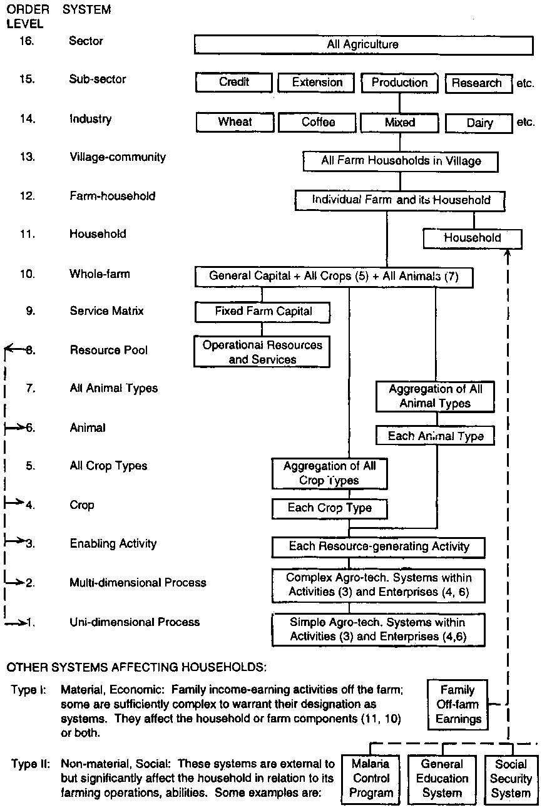

```{r setup, include=FALSE}
library(Hmisc)
library(tidyverse)
knitr::opts_chunk$set(tidy = TRUE, cache = TRUE)
options(htmltools.dir.version = FALSE, knitr.kable.NA = "")
```

# Farm management

## Definition

**Farm management** is a systems-related professional discipline which relates to the description, construction, analysis and evaluation of farm systems of farm-household systems (Order Level 12, as described below). To a layman farm management probably means just that - a body of activities and procedures carried out by a farmer in the ongoing management of his or her farm and for which advice may be available from professional specialists in farm management.

Farm management as carried out by farmers has been defined (Dillon 1980, p. 258) as 'the process by which resources and situations are manipulated by the farm manager in trying, with less than full information, to achieve his [or her] goals'.

## Meaning

Farm management is the science (and art) of optimizing the use of resources in the farm component of farm-households, and of achieving the optimal functioning of these systems in relation to household-specified objectives; and since Order farm-household systems consist structurally of subsystems, farm management is also concerned with the operation of subservient subsystems of lower levels (Order Levels below 9) in such fashion as to optimize the whole-farm system. 
But when dealing with small farms, that farm management extends also to the family or household component, thus its true scope extends to Order Level 12 systems. Sometimes, upper order levels are also the necessary considerations while making economic decisions.

It is also a very pertinent branch of economics as economics is the science of making choices so as to best achieve desired objectives. It comprises making rational choices, e.g., choice of which crops to grow or to the choice between using an insecticide or using environmentally friendly integrated pest management. Aside from this wide applicability of economic analysis, financial analysis of farm, a subset of economic analysis, is the natural way in which to economic analysis is conducted. It is however restricted to matters that are of a financial or monetary nature. In some cases it may be feasible to facilitate economic analysis of possible choices by imputing money values to possible gains and losses. And in yet other cases, such as assessing the resource sustainability and environmental compatibility of alternative farm systems, it may often be infeasible to impute money values to the gains and losses of alternative choices. Decisions must then be made using economic analysis based on non-money values, intuition and judgement.

## Characteristics/Features of farm management

Features of farm mangement can be drawn from the structural elements that comprise a farm-household system:

1. Boundaries: The boundaries of the farm-household system set it apart from other systems and from the world at large. These boundaries are provided partly by the structural characteristics of the particular *type of farm* (small subsistence, small independent, large, commercial, ...), and partly by the purpose of analysis, i.e., to some extent they are subjective and relate to more than the simple physical boundary of the farm.

2. Household: The household plays two roles: first, it provides purpose and management to its associated farm system and, second, it is the major beneficiary of its associated farm system. In its first role it provides purpose, operating objectives and management to the farm component of the farm-household system according to its broad domestic and social goals. Obviously these goals vary widely with culture, tradition and the degree of commercialisation and external influences to which the household is exposed. However, one would probably be not too far wrong in offering a generalization that the primary economic goal on most small farms is security and the primary non-economic goal is social acceptance (Clayton 1983). If this is correct, the primary objectives for the farm are, first, production of a low-risk sustainable subsistence for primary system beneficiaries; second, generation of a cash income to meet needs not directly met in the form of food and other farm-produced materials; and third, pursuit of both of these in ways which are not in conflict with local culture and tradition.

3. Operating plan: The above objectives are pursued through preparation and execution of a farm operating plan. The core of this may be taken as selection of the best possible mix of agro-technical processes, activities, enterprises and fixed capital.

4. Production-enabling resources: The resource pool

5. Final product-generating enterprises

6. Resource-generating activities: They are intended to supplement or entirely supply the resource pool

7. Agro-technical processes: These are defined as systems of Order Levels 1 and 2. Processes may be of a biological or mechanical kind. They are a shorthand designation of all the potentially complex and interrelated physical and biological factors underlying production from crop or livestock species, only some of which may be economically relevant.

8. Whole-farm service matrix: consists of fixed farm capital which provides a flow of services to all other elements of the system, particularly to Elements 5, 6 and 7 but it is not specific to any one of them.

9. Structural (interdependence) coefficients

10. Time dimension.

The other broader relevant features of farm management are:

1. Practical science
    It is the practical science because concepts of farm management imparts farmer the knowledge regarding choices and economic decision making process of crop production, livestock production, and enterprise integration. It includes enabling farmer to adequately consider his/her condition -- Availability of resources, factors of production such as land, soil and environmental status that determine the productivity, volume and schedule of work, distribution of family labor, financial necessities, etc.

2. Profit oriented
    Farm management aims at maximization of return or profit on investment. Although the scale at which profit can be derived depends on several factors such as nature of enterprise (whether it is more risk prone or extractive, or is it more precautionary). A floriculture business seeks prolong the storage and production of cut-flowers. As well as, in the first place, it seeks a more profitable market where potential customers have higher buying capacity for the flower product.
    
3. Integration of science
    The FM has far-reaching/wide integration to other fields of sciences. Basic facts and information of applied sciences, i.e., Horticulture, agronomy, plant protection, animal husbandry, soil science have special place in running a farm enterprise. Mainly, technical efficiency and problem solving/enterpreneurial skills are acquired through subject matter expertise.
    
4. Micro approach
    It has a mico approach to management of farm units. A farm household on the whole is a single unit of management. Testing of and recommendations for resource are based on the farm status and suitability. With regard to availability of resources, opportunities that arise and the problem needed to be tackled, each farm is unique and therefore requires a micro-economic approach to management.
    
5. Broader field
    Although concepts of micro-economics have high relevance to FM, it integrates principles and practices of several disciplines in the real life scenario. Since it appreciates knowledge from many other fields of sciences, farm management specialist has to be a good learner and a broad practitioner. Thus the branch of economics suits "Jack of many trades and Master of one" principle.
    
6. Farm unit as a whole
    Individual farm is the unit of decision making, and the unit that has widest implication of the decision. Similarly, the farm resources availablity status of the farm that is being managed influence the most on planning and decision making process of the farm. When integrated systems are of concern, optimization of whole farm rather than a single enterprise is sought.
    
## Farming system order level

Meaning of farm management can be clearly derived from the **farming system order level** description (shown in Figure \@ref(fig:fs-order-level)).

```{r fs-order-level, fig.width=8, fig.cap="Farming system order levels", echo=FALSE, out.width="100%"}


```


- Order Level 1: Uni-dimensional process systems. Systems of this lowest order are of an agro-technical nature. They involve an issue or problem which for purposes of analysis or management is abstracted from the context in which it naturally or normally occurs. One example is the application of a single fertilizer element, say nitrogen (N), to a crop and consequent plant response to N in terms of crop yield Y. As noted previously, systems of this order are primarily the domain of physical scientists, but those systems which have practical relevance for farmers thereby also have an economic dimension and so fall within the scope of farm economics. Such simple single-dimensional systems are examined as processes and as input-output response relationships.
    
- Order Level 2: Multi-dimensional process systems. Systems of this second order are also concerned with limited agro-technical relationships and again they are primarily the domain of physical scientists. They differ from Order Level 1 systems in that they take - or are defined to take - a wider and more realistic view of a subject or problem. To use the same example of fertilizer response: at Order Level 2 an agro-technical system might involve the response of plant growth or yield Y to not one but to several or a large number of input factors such as nitrogen, phosphorous, irrigation water, crop hygiene, soil tilth etc. These multi-dimensional systems too are examined as processes and as response relationships. Order Level 2 systems can be viewed as aggregations (often interactive) of constituent Order Level 1 systems.

- Order Level 3: Enabling-activity systems. Systems of this order are certain enabling activities which generate an intermediate product intended for use as an input/resource by enterprises which do produce a final product. An example is offered by a legume crop turned under to provide fertility for a following (final product-generating) paddy crop. There will often be alternative ways of obtaining this resource: e.g., stripping leaves off leguminous trees, keeping cattle for their manure, or buying a bag of fertilizer. These are all enabling, resource-generating activities but only some of them, the complex ones, warrant designation as systems. They are intended to supply resources to systems of Order Levels 4 and 6.

- Order Level 4: Crop systems. Systems of this order relate to the production of individual crops; but if these are primarily intended to produce inputs for other crops or livestock, they are regarded as systems of Order Level 3. On many small farms, crop and livestock enterprises produce both final products and resources.

- Order Level 5: All crop systems. Systems of this order, known also as cropping systems, refer to the combined system of all the individual crops on a farm. On a farm with a single mono-crop, this Order Level 5 system will obviously be equivalent to an Order Level 3 system; but on small mixed farms there will usually be four, five, six or more different crops (of Order Levels 3 and 4) grown in some degree of combination and as many as 20 or more on the highly diversified forest-garden farms of South Asia.

- Order Level 6: Animal systems. These systems relate to single-species animal enterprises or activities - e.g., dairy cows, camels, fish, ducks. They are the animal equivalent of Order Level 4 (i.e., individual crop) systems.

- Order Level 7: All animal systems. These systems are the aggregation of all Order Level 6 (sub)systems on a farm. Known as livestock systems, they are the animal equivalent of Order Level 5 (i.e., all crop) systems.

- Order Level 8: Resource pool. This subsystem is a conceptual device for farm-system planning in which resources and fixed-capital services required by other subsystems are 'stored' in a 'resource pool' from which they are allocated to the other subsystems (of Order Levels 1, 2, 3, 4 and 6). The resource pool is central to operation of the whole farm-household system.

- Order Level 9: Farm service matrix. A system of this Order Level consists of all the fixed capital resources of a farm which are pertinent to the operation of the farm as a whole but are not assigned to the exclusive use of any particular enterprise or activity: land, fences, barns, irrigation channels and work oxen are common examples. Some of these capital items are true (sub)systems, having interdependence among their component parts (as in an irrigation storage/delivery/distribution network, a grain drying facility, an integrated network of soil conservation structures etc.). Some are only things (e.g., fences, a plough, a barn). But, in its totality, such capital is managed and manipulated as a system for the purpose of providing general services which, while not specific to them, enable the functioning of lower Order Level systems of the farm.

- Order Level 10: Whole-farm systems. Systems of this Order Level consist of all the lower Order Level (sub)systems which go to make up a farm. They consolidate in a single entity all the farm fixed capital, all the operating capital, all the final-product enterprises, all the activities and all the agro-technical processes which underlie such enterprises and activities. Structuring and managing systems of this Order Level are the main tasks or focus of farm management as carried out, on the one hand, by farmers and as investigated, on the other hand, by farm management economists in their professional capacity of providing advice to farm managers, development agencies and governments.\newline The terms *farm system* and *farming system* are often used interchangeably. The practice is to use farm system to refer to the structure of an individual farm, and farming system to refer to broadly similar farm types in specific geographical areas or recommendation domains, e.g., the wet paddy farming system of West Java or the grain-livestock farming systems of Sind.

- Order Level 11: Household systems. On small farms the household itself is the most dynamic and complex of all farm-level systems, although it is a social system not an agricultural one. It dominates the agricultural systems which comprise the farm component. It has two functions: as household it provides purpose and management to the farm component, and as major system beneficiary it receives and allocates system outputs to itself and other beneficiaries.

- Order Level 12: Farm-household systems. These consist of two components or (sub)systems of Order Levels 10 and 11, i.e., the whole-farm system and its associated household system, respectively. The term is a very useful if not mandatory one when used to refer to the small farms of Asia. It carries an insistence that the technical analysis will amount to nothing at all unless it is applied to achieving the real needs and aspirations of the household - which might be quite a different thing from evaluating the performance of a farm system according to the subjective or preconceived ideas of agricultural technicians and economists (Chambers and Ghildyal 1985; Rhoades and Booth 1982). As the peak farm-level system, the farm-household system may be described in system terms as a goal-setting (i.e., purposeful) open stochastic dynamic system with a major aim of production from agricultural resources. These attributes are sufficient to make it also a complex system. The purposefulness of a farm-household system is ensured by its human and social involvement which enables the system to vary its goals and their means of achievement under a given environment. The openness of the farm-household system is obvious from its physical, economic and social interaction with its environment. The non-deterministic or stochastic nature of the farm-household system is guaranteed both by the free-choice capacity of its human (and, if present, animal) elements and by the stochastic nature of the environment with which it (and all its subsystems) interacts. Necessarily, a farm-household system is also dynamic by virtue of its purposefulness, openness and stochasticity which ensure that the system changes over time. Too, any farm-household system is a mixture of abstract and concrete elements or subsystems. The concrete elements are associated with the physical activities and processes that occur in the system. The abstract elements relate to the managerial and social aspects of the system.


## Objectives of farm management

The goal is to maximize socio-economic welfare of farm families. The term 'welfare' is used broadly to include money income, sustenance food, farm-produced consumption goods and factors of production, non-material benefits such as those enabling the attainment of education and health standards, and satisfactions derived from work well done as well as from cultural and religious sources. 

Whichever of these system outputs/family benefits are relevant in a particular farm situation will depend on the farm type and on the values held by the particular family - values which will normally reflect the society and cultural context in which the farm-household exists. Welfare maximization is conditional because it is constrained by resource availability and, as relevant, legal constraints and socio-cultural mores.

The objective is to achieve the farm household's goals as efficiently as possible, which implies obtaining maximum possible net benefit over time from the operation of the farm system. Net benefit is measured, as appropriate, in terms of output or profit or, more broadly, as satisfaction or utility. Thus the broad objectives of farm management are: 

- Efficient use of available resources and opportunities
- Minimization of costs

These broad objectives can be achieved through:

- Short term strategies: Includes those programs that focus on maximization of profit during a single year. For e.g. Planning and layout, selection of crop varieties, selection of farm management tools for a single year. Achievement of short term objectives depends mainly on production inputs availability and the market opportunities. One of the important tool for meeting short term strategy is the finance, the other is labor input.

- Long term strategies: An important feature of farm resources is the time dimension. Most farm resources take time to restore or recover. For example, loss in soil fertility, erosion of land, exhaustion of diversity etc are some of the factors that influence the productivity which take relatively more time for improvement of their status or revert back the negative changes. A long term strategy of farm mangement is to maximize the output from these components over the years through efficient and sustainable use. This is the basis for achievement of long term objectives.

## Importance of farm management

- Increase in farm income through suitable farm adjustment
- Techological progress
- Industrial development of society
- Generation of employment opportunities
- Farm management as an education tool
- Opportunities with foreign exchange
- Opportunities of resource sharing among enterprises
- Utilization of marginal resources. For e.g. slopy land utilization by pig-cum-poultry farming.
- Improvement of living standard of farmer, and the level of satisfaction
- Reduction in poverty
- Increase in national income
- To bring about agricultural revolution

## Relationship of farm management with other disciplines

As a disciplinary interface to farm-level _economics_, It is obvious that other farm and family-related disciplines will be involved in systems' construction of farm mangement: _agronomy_, _animal husbandry_, _soil and water conservation/management_, _human nutrition_ etc. However, except in the case of special-purpose technical systems (e.g., when the farm-household unit is analysed in terms of nutritional or energy flows among components as discussed below), these other disciplines should play subordinate contributing roles coordinated by farm management economics as the lead discipline. since this type of higher-than-farm-level analysis will be concerned with a range of subject matter in addition to farm economics - _processing_, _marketing_, _transport_, _research_, _extension_ etc. - farm management can operate in different levels of indirect interest to farming household too.

Moreover, in an integrated farming system, such as that of Nepal, farm management has close associations with other disciplines as these are of direct interest to a farmer and are subject of analysis and part of thought process in decision making. For example: 

- A farmer allocates his land parcel (production factor) with the consideration of two or more outputs, which sustain complementaty enterprises in most cases, like legume crop for both farming family nutritional needs along with cereal crop providing for straw to feed livestock.
- By carrying on parallel crop activities by growing one variety/type for the market and another for the family's own use. The first, typically a high-yielding improved variety, might be deficient in taste and storability but will generate cash. The second might be capable of long storage and possess other qualities valuable in rural but not in sophisticated urban markets.
- Livestock kept primarily for manure production (as well as for other purposes). Growing a green manure crop serves a similar purpose. Growing and lopping the leaves from leguminous trees for paddy fertilizer is still common in Java.

Nevertheless, the disciplinary basis of farm management remains economics - but economics of a special wide-ranging kind, the core of which is _production economics_ supported by other branches of economics of which marketing, resource economics, _agricultural credit_ and _data analysis_ (including operations research, econometrics and risk analysis) are probably the most important. When working with the household component, especially of small traditional farms, the most important supporting disciplines are _sociology_ and _social anthropology_.


# Farm record keeping

It is necessary to have sufficient knowledge about farm accountancy in order to handle the farm business efficiently. The farm accounting or accountancy is also called "Farm Book keeping". Farm record keeping is a part of farm business analysis. It is defined as:

- Farm accountancy is defined as the art as well as the science of recording in books business transactions in regular and systematic manner so that their nature, extent and financial effects can be readily ascertained at any time of the year.
- Farm accounting is an application of the accounting principles to the business of farming.
- Farm book keeping is known as a system of records written to furnish a history of the business transactions, with special reference to its financial side.
- The Farm Accountancy or Farm Book Keeping is a matter of Farm Business Analysis.

Accurate and up-to-date records are essential to successful farm management. Before any financial analysis, budgeting, or financial decisions can be made, farm records must be maintained. Managers usually keep farm records for three reasons:

- Legal requirements - such as income tax purposes.
- Obtaining credit - such as filling out loan applications.
- Management tool - such as planning and budgeting.

Most farmers do keep records but primarily for the first two reasons stated above, and not as a management tool. Records should also be used to: 

- Evaluate past performance of the operation,
- Provide a financial picture of the present situation, and
- Serve as a planning guide for future decisions.

More specifically:

- Compare past records to the present and look for progress in the business.
- Areas where costs have risen and consider how they could be lowered.
- Compare volume of product and cost of production.
- Look at level of debt repayment.
- Is financing required?
- What is your most cost efficient crop?
- Where have problems occurred in the past and where will they likely occur in the future?

## Financial record keeping

A record keeping system should go beyond the basic listing of income and expenses. The major financial accounting statements aim to provide a picture of the financial position and performance of a business. A business's accounting system will normally produce three particular statements on a regular, recurring basis

- The \textbf{cash flow statement} \newline A statement that provides either a monthly or quarterly listing of all inflow and outflow (cash in, and cash out) of money from a business. It shows possible shortfalls in cash and thus allows for corrective measures. Unfortunately, this is usually the most neglected management tool.

- The \textbf{income and expense statement} \newline This statement provides a picture of profitability of the farm. How much wealth (that is, profit) was generated, or lost, by the business over that period? (Profit (loss) is defined as the increase (decrease) in wealth arising from trading activities.) \newline This is more accurately done using an accrual statement, which further accounts for inventory, accounts payable, and receivables, as well as depreciation expense.

- The \textbf{balance sheet or net worth statement} \newline This is a listing of all assets and liabilities of a farm at certain point of time. This reports the financial strength and progress of the business.
		

## Net worth statement/Balance sheet/Statement of financial position

It reveals the forms in which the wealth of the business is held and how much wealth is held in each form. We can, however, be more specific about the nature of the balance sheet by saying that it sets out the assets of the business on the one hand, and the claims against the business on the other.

Summary of the financial balances of an individual or organization. A balance sheet is often described as a "**snapshot** of a company's financial condition". Of the three basic financial statements, the balance sheet is the only statement which applies to a single point in time of a business' calendar year. Assets, liabilities and ownership equity are listed as of a specific date, such as the end of its financial year. 

The financial institutes might ask for the net worth statement before considering loan application. The amount entered for calculating the assets valuation should include the exact value that would be earned on selling the asset in the market.

### Assets

An asset is essentially a resource held by the business. The characterstics of an asset are: 

1. A probable future benefit must exist.
2. The business must have an exclusive right to control the benefit.
3. The benefit must arise from some past transaction or event.
4. The asset must be capable of measurement in monetary terms.

The assets could include the cash, investments, etc. Assets can be further sub-divided into:

- Cash & Bank Accounts: details of cash in hand, cheque accounts, savings account, money market funds, cash value of life insurance, etc.
- Investments (Market value): details of certificates of deposit, stocks, bonds, mutual funds, annuities, pension plans, etc.
- Personal Property (Present value): details of automobiles, home furnishing, appliance, furniture, collections, jewellery, etc

### Liabilities

Liabilities represent the claims of all other individuals and organisations, apart from the owner(s). Liabilities must have arisen from past transactions or events such as supplying goods or lending money to the business. When a liability is settled it will normally be through an outflow of assets (usually cash). The liabilities could include loans, debts, etc. Liabilities can be further sub-divided into:

- Current Debts: stores record of debts like household, medical, credit card, bank taxes, legal, etc.
- Mortgage: details of any kind of mortgage debts like home, land, etc.
- Loans: value of debts like bank loans, automobile loan, education loan, life insurance loan, personal loan, etc.

### Owner's equity

When a business wishes to acquire assets, It may raise the funds from the owner(s) or from other outside parties (recorded as liabilities) or from both. The owner's equity represents the claim of the owner(s) against the business. Some find it hard to understand how the owner can have a claim against the business, particularly when we consider the example of a sole-proprietor-type business where the owner is, in effect, the business. However, for accounting purposes, a clear distinction is made between the business (whatever its size) and the owner(s). It is seen as a separate entity with its own separate existence and when financial statements are prepared, they relate to the business rather than to the owner(s). Viewed from this perspective, any funds contributed by the owner will be seen as coming from outside the business and will appear as a claim against the business in its balance sheet.

### Example Net Worth Statement

Net worth or equity or net assets or capital of a company/farm is calculated by calculating the difference between the Total Assets and the Total Liabilities. Looking at the equation in this way shows how assets were financed: either by borrowing money (liability) or by using the owner's money (owner's or shareholders' equity). A business operating entirely in cash can measure its profits by withdrawing the entire bank balance at the end of the period, plus any cash in hand. However, many businesses are not paid immediately; they build up inventories of goods and they acquire buildings and equipment. In other words: businesses have assets and so they cannot, even if they want to, immediately turn these into cash at the end of each period. Often, these businesses owe money to suppliers and to tax authorities, and the proprietors do not withdraw all their original capital and profits at the end of each period. In other words, businesses also have liabilities.

An example Net worth statement of MudnBrick Commercial Vegetable and Livestock Farm is presented in Table \@ref(tab:net-worth-state).

```{r net-worth-state, echo=FALSE}
net_worth <- readxl::read_xlsx("E:/DD/Teaching_s/Economics/Concepts_of_economics/data/concepts_of_economics.xlsx", sheet = "net_worth_state", col_names = FALSE)

net_worth[-c(1,2,3,4),] %>% 
  knitr::kable(format = "latex",
             caption = "Net worth statement",
             col.names = c("", "", "", ""), booktabs = TRUE) %>% 
  kableExtra::kable_styling(position = "center", full_width = FALSE, latex_options = c("striped", "HOLD_position")) %>% 
  kableExtra::add_header_above(c("Net Worth Statement" = 4), bold = T) %>%
  kableExtra::add_header_above(c("Financial condition as of 2011-11-11" = 4), italic = T) %>%
  kableExtra::add_header_above(c("MudnBrick Commercial Vegetable and Livestock Farm" = 4), bold = T) %>%
  kableExtra::row_spec(row = c(1,2,8,9,15,16,21,23,24), bold = TRUE, align = "c")
```


## Cost-return analysis

An economic analysis of cost and returns, is an indicator of profitability in farming activity. However, a general descriptive analysis of costs and returns, is no substitute for a vigorous production function analysis, which serves well as an indicator of the efficiency of factors involved in production. The first and foremost step in financial cost-return analysis is the preparation of Income statement.

## Farm income statement/Profit and loss account

It is not usually enough for users of the financial statements to have information relating only to the amount of wealth held by a business at one moment in time. It is the profit generated during a period that is the main concern of many users of financial statements.

The purpose of the income statement -- or profit and loss account -- is to measure and report how much profit (wealth) the business has generated over a period. As with the balance sheet that we examined in previous section, the principles of preparation are the same. 

The measurement of profit requires that the total revenue of the business, generated during a particular period, be identified. **Revenue** is simply a measure of the inflow of economic benefits arising from the ordinary activities of a business. These benefits, which accrue to the owners, will result in either an increase in assets (such as cash or amounts owed to the business by its customers) or a decrease in liabilities. Some examples of the different forms that revenue can take are as follows:

- sales of goods/crops (for example, of a producer)
- fees for services (for example, of a packaging)
- subscriptions (for example, of a cooperative)
- interest received (for example, of an investment fund).

The total expenses relating to each period must also be identified. **Expense** represents the outflow of economic benefits arising from the ordinary activities of a business. This loss of benefits will result in either a decrease in assets (such as cash) or an increase in liabilities (such as amounts owed to suppliers). Expenses are incurred in the process of generating revenue, or attempting to generate it. Examples of some of the more common types of expenses are:

- the cost of buying goods that are subsequently sold - known as cost of sales or cost of goods sold
- salaries and wages
- rent and rates
- farm machinery and vehicle running expenses
- insurances
- printing and stationery
- energy expenses (heat and light)
- telephone and postage.

The income statement simply shows the total revenue generated during a particular period and deducts from this the total expenses incurred in generating that revenue. The difference between the total revenue and total expenses will represent either profit (if revenue exceeds expenses) or loss (if expenses exceed revenue). The period over which profit or loss is normally measured is usually known as the "accounting period", or "financial period".

The income statement links the balance sheets at the beginning and the end of an accounting period.

An example income statement sheet of a small farmer undertaking vegetable cultivation is shown in Table \@ref(tab:cost-return-an).

```{r cost-return-an, echo=FALSE}
inc_state <- readxl::read_xlsx("./data/concepts_of_economics.xlsx", sheet = "cost_ret_analysis4", skip = 3, col_names = T)

inc_state %>% 
  mutate_at(.vars = vars(contains("amount")), function(x) kableExtra::cell_spec(x, "latex", bold = T, color = kableExtra::spec_color(x, end = 0.9))) %>% 
  knitr::kable(format = "latex",
             caption = "Income statement",
             booktabs = TRUE, escape = FALSE,
             col.names = c("", "Particulars", "Amount (Rs./ropani/annum)")) %>% 
  kableExtra::kable_styling(position = "left", full_width = FALSE, 
                            latex_options = c("striped", "HOLD_position")) %>% # changed full width
  # for rowspec columns with na will be formatted first
  kableExtra::row_spec(row = which(is.na(inc_state[,1])), bold = TRUE, align = "c") %>%
  kableExtra::row_spec(row = 0, italic = TRUE, bold = TRUE) %>%
  kableExtra::add_header_above(c("Income statement" = 3), bold = T)
```

## Production record-keeping

Beyond financial record keeping is production record keeping. The less accurate your production records, the less accurate your financial projections will be. Some of the production records include:

- Farm and field maps (each field, plot or bed numbered and area shown).
- Livestock breeding, feeding, culling, and husbandry records.
- Field history sheets (listing crops grown, soil amendment and/or pest or disease control inputs used now and before).
- Input purchase records (including pesticide or fertilizer labels, seed packets and copies of orders showing product name and supplier, etc.).
- Farm activity logs (planting; fertilizer or pesticide application; soil management practices ; scouting of plant health or disease problems; pest monitoring; harvest; storage, equipment settings; weather conditions , etc. ). The activity logs should show what product(s) are used, the location (field, plot or bed number), date and rate/quantity of application/settings ,etc.
- Sales records (kind and quantity of products marketed - invoices should contain date, name of buyer, products, lot number, amount and price sold) . 

# Farm budgeting

Planning is about reviewing past performance and using the knowledge gained to make future endeavours easier and more successful. After farm planning, budgeting is undertaken. Budgeting is a method of analyzing plans for the use of agricultural resources at the command of the decision maker. Farm plan is a programme of the total farm activity of a farmer drawn up in advance. Farm plan serves as the basis of farm budgeting. Therefore farm plan can be prepared without a budget but budgeting is not possible without farm plan. Therefore the budgeting can be defined as under.

- The physical aspects of farm planning when expressed in monetary terms called budgeting.
- The expression of farm plan in monetary terms by estimation of receipts, expenses and net income is called budgeting.
- Farm budgeting is a process of estimating costs, returns and net profit of a farm or a particular enterprise.
- Budget is a statement of estimated income and expenditure.

We will be concerned with both planning and budgeting as the budget helps us to evaluate alternative plans and select the one that is most profitable. Therefore farm planning and budgeting go side by sides.

Types of farm budgeting: There are two types (methods) of farm budgeting.

1. Partial budgeting: It refers to estimating costs and returns and net income of a particular enterprise. It refers to estimating the returns for a part of the business i.e. one or few activities for example, to estimate additional cost and returns from growing one kattha of rice in place of vegetable crop or to estimate additional cost and return by adopting foliar application of chemical fertilizers instead of soil application.

2. Complete Budgeting: It is also called as total budgeting. It refers to preparing budget for the farm as a whole. Complete budgeting considers all the crops, livestock, methods of production and aspects of marketing in consolidated form and estimates costs and returns for the farm as a whole. Therefore complete budgeting can he specifically defined as "An estimation of the probable income and expenditure is made for the farm as a single unit of course, a complete budget is required when a farm plan is prepared for new farm or when drastic changes are suggested in the plan of the existing pattern on an established farm". Complete budgeting can be prepared for short run (annual budget) and for long run. The differences between partial and complete budgeting is presented in Table \@ref(tab:farm-budgeting).

```{r farm-budgeting, echo=FALSE}
partial_complete <- structure(list(X = 1:5, Complete.Budgeting = structure(c(5L, 
1L, 2L, 4L, 3L), .Label = c("All the aspects like crops, livestock, machinery and other assets are considered", 
"Both fixed and variable costs are calculated for working out costs and returns.", 
"It requires more efforts and time for preparation.", "Net income is estimated by deleting fixed costs and costs of variable inputs from the value of the product", 
"The whole farm is considered as one unit"), class = "factor"), 
    X.1 = 1:5, Partial.Budgeting = structure(c(1L, 2L, 5L, 4L, 
    3L), .Label = c("It is adopted when a minor aspect of farm organization is touched.", 
    "It is practiced with in the existing resources structure of the farm.", 
    "It requires relatively less efforts and time for preparation.", 
    "Net income is estimated by deleting only cost of variable inputs from the value of the product.", 
    "Only variable costs are considered."), class = "factor")), .Names = c("X", 
"Complete.Budgeting", "X.1", "Partial.Budgeting"), class = "data.frame", row.names = c(NA, 
-5L))

# for wide tables use package tabu to wrap the text.
partial_complete %>% knitr::kable(format = "latex", 
             caption = "Difference between complete and partial budgeting",
             col.names = c("", "Complete budgeting", "", "Partial budgeting"), booktabs = TRUE) %>% 
  # HOLD_position does not work with this table, sth to do with caption!
  kableExtra::kable_styling(position = "left", full_width = TRUE, 
                            latex_options = c("striped", "hold_position")) %>% 
  kableExtra::row_spec(0, bold = TRUE) %>% 
  kableExtra::column_spec(c(1, 3), width = "5em")
  
```


# Farm power

A farm power for various agricultural operations can be broadly classified as: Tractive work and Stationary power. These operations are done by different sources of power, namely human, animal, oil engine, tractor, power tiller, electricity and renewable energy (biogas, solar and wind).

Human beings are the main source of power for operating small tools and implements. They are also employed for doing stationary work like threshing, winnowing, chaff cutting and lifting irrigation Water. In crop production system, labour peaks develop due to high labour demands in operations, which cannot be or have not been mechanized so far. For example, the operations like transplanting of paddy, weeding and inter-culture operations or harvesting of crops demand large number of human labour on each of the farms.

Animals provide for major source of power on farms all over Nepal, especially in Hilly regions. Major sources of animal power are cattle, donkey, mules, elephant, camel, etc. The average force a bullock can exert is nearly equal to one tenth of its body weight. Generally a medium size bullock can develop between 0.50 to 0.75 hp.

The third important source of farm power is mechanical power that is available through tractors and oil engines. The oil engine is a highly efficient device for converting fuel into useful work. The efficiency of diesel engine varies between 32 and 38 per cent, whereas that of the carburettor engine is in the range of 25 and 32 per cent. In recent years, diesel engines and tractors have gained considerable popularity in agricultural operations. Small pumping sets within 3 to 10 hp range are very much in demand.

Now-a-days electricity has become a important as well as popular source of power on farms in various states of the country. It is steadily becoming more and more available with the increase of hydroelectricity generation through establishing Hydropower projects.

Some differences between the mechanical and animal power is summarized below:

```{r mechanical-vs-animal, echo=FALSE}
readxl::read_xlsx("./data/concepts_of_economics.xlsx", sheet = "farm_power") %>% 
  knitr::kable(format = "latex", 
             caption = "Distinction between mechanical and animal farm power",
             col.names = c("", "Basis", "Tractor/Power tiller", "Animal"), booktabs = TRUE) %>% 
  kableExtra::kable_styling(position = "left", full_width = TRUE, 
                            latex_options = c("striped", "HOLD_position")) %>% 
  kableExtra::row_spec(0, bold = TRUE) %>% 
  kableExtra::column_spec(c(3,4), width = "18em") %>% 
  kableExtra::column_spec(1, width = "4em") %>% 
  kableExtra::landscape()
```
