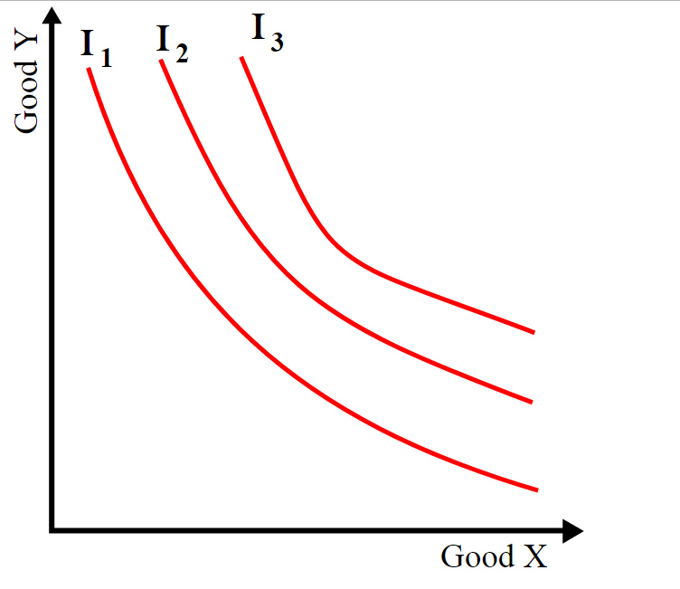
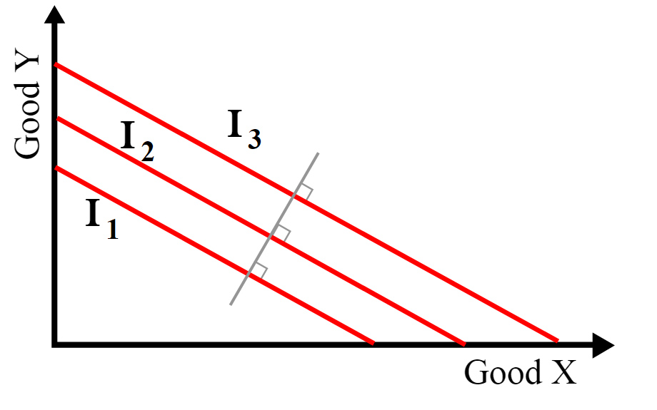
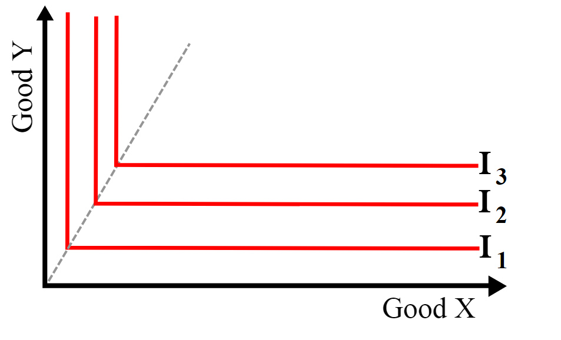
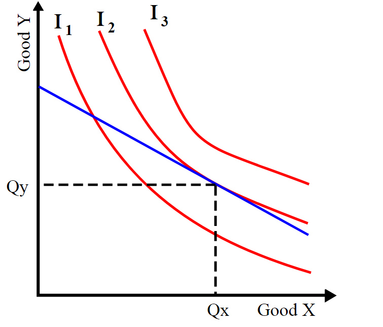

```{r setup, include=FALSE}
library(Hmisc)
library(tidyverse)
library(tufte)
# invalidate cache when the tufte version changes
knitr::opts_chunk$set(tidy = FALSE, cache.extra = packageVersion('tufte'), cache = TRUE)
options(htmltools.dir.version = FALSE, knitr.kable.NA = "")
# add following line to yaml output format options for extending referencing.
# pandoc_args: ["-F", "C:/Program Files/RStudio/bin/pandoc/pandoc-crossref.exe"]
```

# Background

The handout is intended for students trying to have basic starting idea on the course of economics. An agricultural economics based approach is taken, to delve in to the concepts of Micro and Macro economics. The note is expected to be helpful to students preparing for upper and lower secondary level examinations.

While teaching Farm Management and Marketing course, I felt the necessity to deliver contents to students in a broad context, afterall farm mangement is just a part wider field of economics. The question solution approach to this note should provide succinct answers to, as well as a more elaborate exposition in a follow through, conceptual questions surrounding the applied course. The contents presented here, however, do not form a sound basis for practical understanding.

# Questions

1. State Adam Smiths' definition of economics.
2. Define cost.
3. What is income statement?
4. Give an example of monopoly market.
5. What is Farm Planning?
6. What is Agriculture Marketing?
7. What are the types of utility? Give examples.
8. State the law of supply. Describe with the help of supply curve diagram.
9. What are the characteristics of perfect competition market?
10. What do you mean by price variation? Describe with examples.
11. What are the functions of WTO?
12. Explain the principle of substitution.
13. Write the importance of farm plan.
14. What do you mean by Net-worth statement?
15. Give the differences between complete and partial budgeting.
16. Agriculture commodities are seasonal in nature. Justify.
17. What are the selection criteria of best channel for distribution of agriculture commodities.
18. Write the characteristics of the material welfare definition of economics.
19. Explain in detail about the farm record.
20. What are the objectives of farm management?
22.	State the law of demand with its assumptions. Give a description with suitable examples.
23.	Define farm management. Highlight its importance.
24.	Explain the principle of product substitution in detail.
25.	Explain in detail about farm efficiency measures.
26.	Describe the role of cooperatives in Nepalese economy.
27.	Classify markets of Nepal on different basis.
28.	What is a marketing channel? Explain with suitable examples.
29. Define capital.
30. Define cooperative farming.
31. What is marketing margin?
32. What is a whole sale market?
33. Write the features of land.
34. What are the problems of farm record keeping in Nepal?
35. Explain the law of diminishing marginal utility.
36. Write the properties of indifference curve with examples.
37. What is market?
38. Explain the importance of agricultural marketing in socio-economic development of Nepal.
39. Write notes on following topics:
    - Goods
    - Labor
    - Wealth
    - Service
    - Equilibrium
    - Price line
40. What is meant by elasticity of supply?

# Solutions

# Meaning and Definition of Economics

An economy is a system for coordinating society's productive activities. 

- Economics is the social science that studies the production, distribution, and consumption of goods and services.
- Economics is the study of individual choices and decisions. People must make choices because resources are scarce.

`r tufte::margin_note("\\textbf{Microeconomics} \\newline The branch of economics that studies how people make decisions and how these decisions interact.")`

`r tufte::margin_note("\\textbf{Macroeconomics} \\newline The branch of economics that is concerned with overall ups and downs in the economy.")`

The objective of microeconomics are:

1. Economic efficiency: productive efficiency, consumptive efficiency and allocative efficiency
2. Equity: A distribution of income that is considered to be fair or just.

The discipline of economics has developed principles, theories, and models that isolate the most important determinants of economic events. In constructing a model, economists make assumptions to eliminate unnecessary detail to reduce the complexity of economic behavior. Once modeled, economic behavior may be presented as a relationship between dependent and independent variables. The behavior being explained is the dependent variable; the economic events explaining that behavior are the independent variables.The dependent variable may be presented as depending upon one independent variable, with the influence of the other independent variables held constant (the _ceteris paribus_ assumption).


**Problem of scarcity**

Economics is the study of scarcity-- the study of the allocation of scarce resources to satisfy human wants. People's material wants, for the most part, are unlimited. Output, on the other hand, is limited by the state of technology and the quantity and quality of the economy's resources. Thus, the production of each good and service involves a cost. A **good** is usually defined as a physical item such as a car or a hamburger, and a service is something provided to you such as insurance or a haircut. Scarcity is a fundamental problem for every society. Decisions must be made regarding _what to produce_, _how to produce_ it, and _for whom to produce_. What to produce involves decisions about the kinds and quantities of goods and services to produce. How to produce requires decisions about what techniques to use and how economic resources (or factors of production) are to be combined in producing output.

## Positive and Normative economics

Positive questions have to do with explanation and prediction, normative questions with what ought to be. Positive and normative economics are often synthesized in the style of practical idealism. In this discipline, sometimes called the "art of economics," positive economics is utilized as a practical tool for achieving normative objectives.


**Positive economics**: Positive economics tries to reason the cause and effect of an economic activity. Questions such as "What will happen if?" and "What impact will it have on" are all in the realm of positive analysis. Positive analysis is central to microeconomics. Theories are developed to explain phenomena, are tested against observations, and are used to construct models from which predictions are made.

The use of economic theory for prediction is important both for the managers of firms and for public policy. Suppose the federal government is considering raising the tax on gasoline. The tax would affect the price of gasoline, consumers' preferences for small or large cars, the amount of driving that people do, and so on. To plan sensibly, oil companies, automobile companies, producers of automobile parts, and firms in the tourist industry would all want to know how large the various effects of this tax will be. Government policymakers would also need quantitative estimates of the effects of the tax. They would want to determine the costs imposed on consumers (perhaps broken down by income categories); the effects on profits and employment in the oil, automobile, and tourist industries; and the amount of tax revenue likely to be collected each year.


**Normative economics**: A part of economics that expresses value or normative judgments about economic fairness or what the outcome of the economy or goals of public policy ought to be. Sometimes we want go beyond explanation and prediction to ask questions, such as "What is best?". This involves normative analysis. For example:

> _"The price of milk should be $6 a gallon to give dairy farmers a higher living standard and to save the family farm."_
>
> `r tufte::quote_footer("--- Normative economics")`

This is a normative statement, because it reflects value judgments. This specific statement makes the judgment that farmers deserve a higher living standard and that family farms ought to be saved. Subfields of normative economics include social choice theory, cooperative game theory, and mechanism design.

Normative analysis is important both for managers of firms and for designers of new public policies. Again, consider a new tax on gasoline. Automobile companies would want to determine the best (profit-maximizing) mix of large and small cars to produce once the tax is in place, or how much money should be invested to make cars more fuel-efficient. For policymakers, the primary issue is likely to be whether this tax is in the public interest. The same policy objectives (say, an increase in tax revenues and a decrease in our dependence on imported oil) might be met more cheaply with a different kind of tax, such as a tariff on imported oil. Normative analysis is not only concerned with alternative policy options; it also involves the design of particular policy choices. For example, suppose it has been decided that a gasoline tax is desirable. Balancing costs and benefits, we then ask what is the optimal size of the tax?

`r tufte::margin_note("\\textbf{Resource} \\newline Anything that can be used to produce something else.")`

`r tufte::margin_note("\\textbf{Scarce} \\newline A state of resource availability of not being able to satisfy all the various ways a society wants to use them.")`

The **opportunity cost** of an item-what you must give up in order to get it-is its **true cost**.

"How much" decisions require making trade-offs at the margin: comparing the costs and benefits of doing a little bit more of an activity versus doing a little bit less.

People usually respond to incentives, exploiting opportunities to make themselves better off.

- Market economy: An economy in which decisions about production and consumption are the result of decentralized decisions made by individual producers and consumers.
- Command economy: there is a central authority making decisions about production and consumption.

`r tufte::margin_note("When the individual pursuit of self-interest leads to bad results for society as a whole, there is \\textbf{market failure}.")`

## Pioneers' perspective

**Adam Smith**

In 1776 book (_An Inquiry into the Nature and Causes of the Wealth of Nations_), Adam Smith wrote about how individuals, in pursuing their own interests, often end up serving the interests of society as a whole. Of a businessman whose pursuit of profit makes the nation wealthier, Smith wrote:

> _"[H]e intends only his own gain, and he is in this, as in many other cases, led by **an invisible hand** to promote an end which was no part of his intention."_
>
> `r tufte::quote_footer("--- Adam Smith")`


**Alfred Marshall**

A British economist (1842-1924), who developed some of the most important concepts in microeconomics. In his best-known work, Principles of Economics, he retained the emphasis on the importance of costs, which was standard in classical economics. But he added to it, helping to create neo-classical economics, by explaining that the output and price of a product are determined by both supply and demand, and that marginal costs and benefits are crucial. He was the first economist to explain that demand falls as price increases, and that therefore the demand curve slopes downwards from left to right. He was also first with the concept of price elasticity of demand and consumer surplus.

**Lionel Robins**


# Utility

The specialized language of economics makes broad use of the word "utility." It means much more than just usefulness. It takes on a meaning of satisfaction, or happiness, or fulfillment. If an object has utility in an economic sense, then it is bringing some kind of reward to its owner or the person who is using it. It is a concept applicable to all goods and services. Food has utility because it keeps people alive. A football game has utility because it entertains the spectators. Social friends have utility because they are there to help or to be helped.

`r tufte::margin_note("\\textbf{Utility} \\newline Satisfaction derived from consuming a good")`

## Cardinal and ordinal utility

About 200 years ago, Jeremy Bentham (1748-1832) and a number of other economists struggled to find a way to measure utility. They tried to assign an actual numerical value to the amount of satisfaction that each good or service produced and conferred on its user. These economists developed a hypothetical unit, called a "util," to measure consumers' levels of happiness, or satisfaction.

`r tufte::margin_note("\\textbf{Utils} \\newline Hypothetical units of satisfaction derived from consumption of goods or services.")`


**Cardinal Utility** 

The assignment of specific, but hypothetical, numerical values to the level of satisfaction gained from the consumption of a good. The unit of measurement is the hypothetical util. 

The early Neoclassical approach was developed by Edgeworth, Sidgwick, Marshall, and Pigou. It assumes the following:

- Utility is scale-measurable by observation or judgment.
- Preferences are exogenously given and stable.
- Additional consumption provides smaller and smaller increases in utility (diminishing marginal utility).
- All individuals have interpersonally commensurable utility functions.

With these assumptions, it is possible to construct a social welfare function simply by summing all the individual utility functions. Note that such a measure would still be concerned with the distribution of income (distributive efficiency) but not the distribution of final utilities. 

The concept of Cardinal utility can be used as a tool to conveniently communicate how consumer behavior works.


**Ordinal Utility** 

It is a way of considering consumer satisfaction in which goods are ranked in order of preference: first, second, third, etc. Ordinal preferences do not depend on specific numbers or values.

In economics, an ordinal utility function is a function representing the preferences of an agent on an ordinal scale. The ordinal utility theory claims that it is only meaningful to ask which option is better than the other, but it is meaningless to ask how much better it is or how good it is. All of the theory of consumer decision-making under conditions of certainty can be, and typically is, expressed in terms of ordinal utility.

## Marginal Utility (MU) and Total Utility (TU)

The additional amount of satisfaction gained from consuming one more unit of a good and Total Utility (TU) is the cumulative satisfaction received from the entire collection of the good or service.

- Marginal Utility [MU] = the change in the level of utility when consumption of a good is increased by one unit. 

$$MU = \delta TU/\delta Y$$

- Total Utility [TU] = the total level of satisfaction derived from consuming a given bundle of goods and services.

Applying these concepts to a hypothetical example of consumer behavior enhances understanding. The example here is drinking bottles of cold water after a long, hot day of work. In this case, one major prediction regarding consumer behavior is that "first is best." The first unit of a good consumed yields the most satisfaction. The second unit is less satisfying. Additional satisfaction, or utility, comes from each unit consumed, but typically, the amount of satisfaction from each successive bottle of water diminishes.

# Cost

Cost is the value of the factors of production used in producing and distributing goods and services. The cost of a factor unit equals the maximum amount which the factor could earn in alternative employment.

The cost refers to:
- The amount of fund used in production. 
- Outlay of funds and/or productive purposes. 
- The expenses incurred on productive services and physical input factors.

Cost analysis is an important tool to describe the relationship of costs to income. Commonly, there are two types of costs used in farming viz fixed costs and variable costs. However, marginal or added cost is also an important tool to guide the farmer to decide, how far he can push the production and how much of various resources he can use.

## Fixed cost

Fixed cost are those costs which do not change in relation to the output. This cost is therefore ever present, even when no production is being done. This may be cash or non-cash. These costs are related to fixed resources and are overhead costs. e.g. 

- Cash fixed cost: Land, taxes, insurance, lease rent, salary, annually hired labor
- Non cash fixed cost: Depreciation of building, interest on money, family labor

Fixed costs have little relation to making decision on the level of production of farming practices.

## Variable cost

Those cost that vary with the level of production. The costs increases when the production is increased and vice versa. The variable costs are nil, if there is no production on the farm. 

In the beginning, as the production increases, variable costs rise quite rapidly, but with further rise in production variable costs do not increase proportionately with the production due to economics brought about by mass production. Later on, as diminishing returns set in, variable costs start rising more rapidly than the production. If farming is to be carried, the variable cost must be less than selling price.

Example of variable costs include current supplies such as seeds, fertilizers, irrigation, insecticides, hired labour charges, interest on working capital.

## Average cost

## Marginal cost

The additional cost of doing a little bit more (or 1 unit more if a unit can be measured) of an activity.

How do you make a rational decision about when the alarm should go off? What you have to do is to weigh up the costs and benefits of additional sleep. Each extra minute in bed gives you more sleep (the marginal benefit), but gives you more of a rush when you get up (the marginal cost). The decision is therefore based on the costs and benefits of extra sleep, not on the total costs and benefits of a whole night's sleep.

# Rational decision

Doing more of an activity if its marginal benefit exceeds its marginal cost and doing less if its marginal cost exceeds its marginal benefit.

Rational decisions are made with Rational choices; that involve weighing up the benefit of any activity against its opportunity cost.

# Production-Possibility Frontier

A production-possibility frontier shows the maximum number of alternative combinations of goods and services that a society can produce at a given time when there is full utilization of economic resources and technology. 

Table [@tab:ppschedule] shown below, presents alternative combinations of guns and butter output for a hypothetical economy (guns represent the output of military goods, while butter represents nonmilitary goods and services). In choosing what to produce, decision makers have a choice of producing, for example, alternative C-- 5,000 guns and 14 million units of butter-- or any other alternative presented.

```{r ppschedule, echo=FALSE}
pps_less <- readxl::read_xlsx("./data/concepts_of_economics.xlsx", 
                               sheet = "production_possibility_schedule", col_names = TRUE)
knitr::kable(pps_less, format = "latex", 
             caption = "Production possibility schedule", booktabs = TRUE) %>% 
  kableExtra::kable_styling(bootstrap_options = "striped", position = "left", full_width = FALSE) %>% 
  kableExtra::column_spec(1:3, width = "12em")
```


This production-possibility schedule is plotted in Figure [@fig:ppfrontier]. The curve, labeled PP, is called the production-possibility frontier. Point C plots the combination of 5,000 guns and 14 million units of butter, assuming full employment of the economy's resources and full use of its technology, as do all of the alternatives presented in Table [@tab:ppschedule].

```{r ppfrontier, fig.cap="Production possibility frontier", fig.width=7, fig.height=5, out.width="110%", echo=FALSE}
pps_curve <- data.frame(x2 = 2.62, x1 = 3.57, y2 = 12.0, y1 = 10.0)

pps_less %>% 
  ggplot(mapping = aes(x = `Guns (thousand units)`, y = `Butter (million units)`)) +
  geom_path(color = "blue") + 
  geom_curve(aes(x = max(.[,2]), 
                 y = min(.[,3]), 
                 xend = min(.[,2]), 
                 yend = max(.[,3])), curvature = 0.3, color = "red")
  
```


# Indifference curve

Each indifference curve is a set of points, each representing a combination of quantities of two goods or services, all of which combinations the consumer is equally satisfied with. The further a curve is from the origin, the greater is the level of utility.

The slope of the curve (the negative of the marginal rate of substitution of X for Y) at any point shows the rate at which the individual is willing to trade off good X against good Y maintaining the same level of utility. The curve is convex to the origin as shown assuming the consumer has a **diminishing marginal rate of substitution**. It can be shown that consumer analysis with indifference curves (an ordinal approach) gives the same results as that based on cardinal utility theory - i.e., consumers will consume at the point where the marginal rate of substitution between any two goods equals the ratio of the prices of those goods (the equi-marginal principle).

A graph of indifference curves for several utility levels of an individual consumer is called an **indifference map**. Points yielding different utility levels are each associated with distinct indifference curves and these indifference curves on the indifference map are like contour lines on a topographical map. Each point on the curve represents the same elevation. If you move "off" an indifference curve traveling in a northeast direction (assuming positive marginal utility for the goods) you are essentially climbing a mound of utility. The higher you go the greater the level of utility. The non-satiation requirement means that you will never reach the "top," or a "bliss point," a consumption bundle that is preferred to all others.

```{r indifference-map, fig.width=8, fig.height=6, fig.cap="Indifference curves", fig.fullwidth=FALSE, echo=FALSE, eval=TRUE, out.width="105%"}

# # run as a block
# df <- data.frame(x.ax = c(1, 3, 9), y.ax = c(9, 3, 1))
# plot(df, col="white")
# res <- bezier(seq(0, 1, len=100), df, deg=nrow(df)-1)
# points(res, type="l", col="green", lwd=2)
# df1 <- data.frame(x.ax = c(1, 3, 9-1)+1, y.ax = c(9-1, 3, 1)+1)
# res1 <- bezier(seq(0, 1, len=100), df1, deg=nrow(df1)-1)
# points(res1, type="l", col="green", lwd=2)

idc1 <- Hmisc::bezier(x = c(1, 3, 9),
                        y = c(9, 3, 1)) %>%
  as_data_frame()

idc2 <- Hmisc::bezier(x = c(1+1, 3, 9),
                        y = c(9, 3, 1+1)) %>%
  as_data_frame()

idc3 <- Hmisc::bezier(x = c(1+2, 3, 9),
                        y = c(9, 3, 1+2)) %>%
  as_data_frame()

idc4 <- Hmisc::bezier(x = c(1-1, 3, 9),
                        y = c(9, 3, 1-1)) %>%
  as_data_frame()

all_idcs <- bind_rows(idc1, idc2, idc3, idc4, .id = "id")

ggplot(all_idcs, aes(x = x, y = y, colour = id)) + 
  geom_path(size = 1) + 
  scale_color_manual(values = colorRamps::blue2green(4)) +
  theme_classic() + 
  coord_equal()
```

## Application

Consumer theory uses indifference curves and budget constraints to generate consumer demand curves. For a single consumer, this is a relatively simple process. First, let one good be an example market e.g., carrots, and let the other be a composite of all other goods. Budget constraints give a straight line on the indifference map showing all the possible distributions between the two goods; the point of maximum utility is then the point at which an indifference curve is tangent to the budget line (illustrated). This follows from common sense: if the market values a good more than the household, the household will sell it; if the market values a good less than the household, the household will buy it. The process then continues until the market's and household's marginal rates of substitution are equal. Now, if the price of carrots were to change, and the price of all other goods were to remain constant, the gradient of the budget line would also change, leading to a different point of tangency and a different quantity demanded. These price / quantity combinations can then be used to deduce a full demand curve. A line connecting all points of tangency between the indifference curve and the budget constraint is called the expansion path.

```{r indifference-curve1, fig.cap="An example of an indifference map with three indifference curves represented.", echo=FALSE, eval=TRUE, out.width="70%"}

```


```{r indifference-curve2, fig.cap="Three indifference curves where Goods X and Y are perfect substitutes. The gray line perpendicular to all curves indicates the curves are mutually parallel.", echo=FALSE, eval=TRUE, out.width="70%"}

```


```{r indifference-curve3, fig.cap="Indifference curves for perfect complements X and Y. The elbows of the curves are collinear.", echo=FALSE, eval=TRUE, out.width="70%"}

```

In Figure [@fig:indifference-curve1], the consumer would rather be on I3 than I2, and would rather be on I2 than I1, but does not care where he/she is on a given indifference curve. The slope of an indifference curve (in absolute value), known by economists as the marginal rate of substitution, shows the rate at which consumers are willing to give up one good in exchange for more of the other good. For most goods the marginal rate of substitution is not constant so their indifference curves are curved. The curves are convex to the origin, describing the negative substitution effect. As price rises for a fixed money income, the consumer seeks the less expensive substitute at a lower indifference curve. The substitution effect is reinforced through the income effect of lower real income (Beattie-LaFrance). The negative slope of the indifference curve incorporates the willingness of the consumer to make trade offs.

If two goods are perfect substitutes then the indifference curves will have a constant slope since the consumer would be willing to switch between at a fixed ratio; shown in Figure [@fig:indifference-curve2]. The marginal rate of substitution between perfect substitutes is likewise constant.

If two goods are perfect complements then the indifference curves will be L-shaped; shown in Figure [@fig:indifference-curve3]. Examples of perfect complements include left shoes compared to right shoes: the consumer is no better off having several right shoes if she has only one left shoe - additional right shoes have zero marginal utility without more left shoes, so bundles of goods differing only in the number of right shoes they include - however many - are equally preferred. The marginal rate of substitution is either zero or infinite.

The different shapes of the curves imply different responses to a change in price as shown from demand analysis in consumer theory. The results will only be stated here. A price-budget-line change that kept a consumer in equilibrium on the same indifference curve:

- in Figure [@fig:indifference-curve1] would reduce quantity demanded of a good smoothly as price rose relatively for that good.

- in Figure [@fig:indifference-curve2] would have either no effect on quantity demanded of either good (at one end of the budget constraint) or would change quantity demanded from one end of the budget constraint to the other.

- in Figure [@fig:indifference-curve3] would have no effect on equilibrium quantities demanded, since the budget line would rotate around the corner of the indifference curve.

```{r expansion-path, fig.width=7, fig.cap="Indifference curves and deduction of demand schedule for a simple good. To maximise utility, a household should consume at (Qx, Qy). Assuming it does, a full demand schedule can be deduced as the price of one good fluctuates.", echo=FALSE, out.width="70%"}


```

# Law of Demand

## Demand

"Demand" and "supply" are the twin driving forces of the market economy. Demand is not just about measuring what people want; for economists, it refers to the amount of a good or service that people are both willing and able to buy. The demand curve measures the relationship between the price of a good and the amount of it demanded. Usually, as the price rises, fewer people are willing and able to buy it; in other words, demand falls (but see giffen goods, normal goods and inferior goods). When demand changes, economists explain this in one of two ways. A movement along the demand curve occurs when a price change alters the quantity demanded; but if the price were to go back to where it was before, so would the amount demanded. A shift in the demand curve occurs when the amount demanded would be different from what it was previously at any chosen price, for example, if there is no change in the market price, but demand rises or falls. The slope of the demand curve indicates the **elasticity of demand**. 

Policymakers seek to manipulate aggregate demand to keep the economy growing as fast as is possible without pushing up inflation. Keynesians try to manage demand through fiscal policy; monetarists prefer to use the money supply. Neither approach has been especially successful in practice, particularly when attempting to manage short-term demand through fine tuning.

**Demand curve**

A graph showing the relationship between the price of a good and the amount of demand for it at different prices.

```{r demand-curve1, fig.width=8, fig.height=6, out.width="105%", eval=TRUE, fig.cap="Demand and supply curves showing change in demand", fig.fullwidth=FALSE, echo=FALSE, eval = TRUE}

# curve1 and curve2 should be data.frames with an x and y column
# For instance, as_data_frame(Hmisc::bezier(c(1, 8, 9), c(1, 5, 9)))
#
curve_intersect <- function(curve1, curve2) {
  # Approximate the functional form of both curves
  curve1_f <- approxfun(curve1$x, curve1$y, rule = 2)
  curve2_f <- approxfun(curve2$x, curve2$y, rule = 2)

  # Calculate the intersection of curve 1 and curve 2 along the x-axis
  point_x <- uniroot(function(x) curve1_f(x) - curve2_f(x), 
                     c(min(curve1$x), max(curve1$x)))$root

  # Find where point_x is in curve 2
  point_y <- curve2_f(point_x)

  # All done!
  return(list(x = point_x, y = point_y))
}

supply <- Hmisc::bezier(c(1, 8, 9),
                        c(1, 5, 9)) %>%
  data.frame()

demand <- Hmisc::bezier(c(1, 3, 9),
                        c(9, 3, 1)) %>%
  as_data_frame()

demand1 <- Hmisc::bezier(c(1, 3, 9),
                        c(9, 3, 1)) %>%
  as_data_frame()

demand2 <- Hmisc::bezier(c(3, 5, 11),
                         c(11, 5, 3)) %>%
  data.frame()

# Calculate the intersections of the two curves
intersections <- bind_rows(curve_intersect(supply, demand1),
                           curve_intersect(supply, demand2))

plot_labels <- data_frame(label = c("S", "D[1]", "D[2]"),
                          x = c(8, 1, 5),
                          y = c(8, 8, 8))

ggplot(mapping = aes(x = x, y = y)) + 
  geom_path(data = supply, color = "#0073D9", size = 1) + 
  geom_path(data = demand, color = "#FF4036", size = 1, linetype = "dashed") + 
  geom_path(data = demand2, color = "#FF4036", size = 1) + 
  geom_segment(data = intersections, 
               aes(x = x, y = 0, xend = x, yend = y), lty = "dotted") +
  geom_segment(data = intersections, 
               aes(x = 0, y = y, xend = x, yend = y), lty = "dotted") + 
  geom_text(data = plot_labels,
            aes(x = x, y = y, label = label), parse = TRUE) +
  annotate("segment", x = 3.5, xend = 4.5, y = 6, yend = 7,
           arrow = arrow(length = unit(1, "lines")), colour = "grey50") +
  geom_point(data = intersections, size = 3) +
  scale_x_continuous(expand = c(0, 0), breaks = intersections$x,
                     labels = expression(Q[1], Q[2])) +
  scale_y_continuous(expand = c(0, 0), breaks = intersections$y,
                     labels = expression(P[1], P[2])) +
  labs(x = "Quantity", y = "Price",
       title = "Rightward shift in demand",
       subtitle = "As demand increases, so does price") +
  coord_equal() +
  theme_classic() + 
  theme(plot.title = element_text(size = rel(1.3)))
```

# Law of Supply

## Supply


# Economics of production

It describes the physical relationship between inputs and outputs, and describes the economics of transforming inputs into products; resources into goods. 

## The production function

The production of goods and services is a logical place to begin studying the economics of agricultural production. During the production process, firms, or producers, combine inputs into outputs for sale to consumers. The process can be quite complex. Then follows the production activities undertaken by firms. The discussion then shifts to the behavior of consumers, or households. All of this leads to consideration of the interactions of consumers and producers in markets. **Production** is the process of producing goods and services. This process requires scarce resources.

Inputs have several different names:
Inputs = factors = factors of production = resources = A, L, K, M

`r tufte::margin_note("\\textbf{A}:Land (Natural and biological resources, climate.) \\newline \\textbf{L}:Labor (Human resources.) \\newline \\textbf{K}:Capital (Manufactured resources, which include buildings, machines, tools, and equipment.) \\newline \\textbf{M}: Management (The entrepreneur, or individual, who combines the other resources into inputs.)")`

_Wheat production in Bhairahawa, Rupandehi_

Consider a wheat producer in Bhairahawa, Rupandehi, a leading wheat producing district in Nepal. Let $Y$ = output = wheat, measured in tons (ton), where $f$ = the mathematical relationship between inputs and output:

$$Output = f(Inputs)$$

$$Y = f(K, L, A, M)$$

The relationship is fairly complex, with multiple variable inputs. Thus, to reduce complexity let us consider the relationship between inputs and outputs, and concentrate on just one input: The capital. In this case, the choice of capital is entirely arbitrary, since any one of the inputs could fit into the example.

`r tufte::margin_note("The \\textit{ceteris paribus} assumption isolates the relationship between output and the single input, capital.")`

A mathematician writes an equation to say that the variable Y is related to, or depends on other variables $x_1, x_2, x_3, ..., x_n$. The equation is written as:

$$Y = f(x_1, x_2, x_3, ..., x_n)$$

Following mathematical convention, the variable $x_1$ to the left of the vertical bar is free to vary, but all variables to the right of the vertical bar, in this case, $x_2, ..., x_n$ , are held constant:

$$Y = f(x_1|x_2, ..., x_n)$$

We, can rewrite the example equation that of wheat production in Bhairahawa for varying just one input ($K$) to the left of the vertical bar as follows. Real physical production is a complicated biological process. Therefore, one input at a time must be isolated:

$$Y = f(K | L, A, M)$$

This equation is what mathematicians refer to as a function. Economists provide a more descriptive term by calling it a **Production Function.**

The production function is a purely physical relationship used to describe the quantity of inputs required to produce a given quantity of output. Since there are no money (Rupees) values associated with it, it is not an economic relationship.

To determine the optimal use of the fertilizer nitrogen on wheat fields, agronomists can run controlled experiments to determine what happens to wheat yields as the amount of nitrogen is changed: either increased or decreased. They do this type of experiment on test plots, or small wheat fi elds that are typically adjacent to each other to keep constant the weather, growing conditions, and soil conditions across all of the plots. The idea behind the controlled experiment is to hold all inputs constant except for nitrogen, and measure how the different levels of nitrogen ($N$) affect the wheat yields. The wheat production function would look like this:

$$Y = f(N, L, K, M, A)$$

> Think of what can be closest syntactic production factors replacements for $L, K, M, A$

`r tufte::newthought("How about land, labor, machinery and seed?")`

To isolate the relationship between nitrogen and wheat yields, the agronomists (or other biophysical scientists) will hold constant all inputs other than the one that they are isolating, in this case nitrogen.

$$Y = f(N | L, K, M, A)$$

This relationship is highly important, since too little nitrogen means the yields will be lower than the potential, and too much nitrogen will "burn" the crop, causing smaller yields. Figure [@fig:nitrogen-wheat] shows the connection between nitrogen applications and wheat yields.

```{r nitrogen-wheat, fig.width=7, fig.height=5, out.width="100%", eval=TRUE, fig.cap="Relationship between Nitrogen application and Yield", fig.fullwidth=FALSE, echo=FALSE, eval = TRUE}
## bezier control points

# try different forms of lines, same two values for x-es results in unpredictable shapes
# poi <- lapply(5:8, function(x) matrix(c(10, 2, x, 1, 2, 8), ncol = 2, nrow = 3, byrow = TRUE))
# poi[c(1:2)]

poi <- lapply(5:8, function(x) matrix(c(10, -4, x, 1, 6, 8, 4, 4), ncol = 2, nrow = 4, byrow = TRUE))

# three points(nrow=3), 1D(ncol=1) bezier curve
map_df(poi[c(4)], .f = ~ bezier::bezier(t = seq(0, 2, length.out = 100), p = .x) %>%
  as_tibble()) %>% 
  ggplot(aes(V1, V2)) + 
    geom_line() + 
    xlab("Nitrogen") + 
    ylab("Yield")
# change the axis tick labels?
```


## Yield versus Productivity

The point of maximum physical wheat yield (N\*) is not always the optimal economic wheat yield. This is because nitrogen is a scarce resource, and costs money to purchase. In fact, fertilizer is one of the major costs of production for farmers in most agricultural regions in the United States. If nitrogen were free, then the optimal application to a wheat field would always be N\* in Figure 2.1 , since this is the level of nitrogen that maximizes production. 

However, since it costs money to purchase and use fertilizer, the farmer will stop applying it at a point to the left of N\*. Finding the optimal amount of nitrogen to apply requires application of economic principles. Economic reasoning will help determine the exact point where the benefits of using N minus the costs are maximized. For now, note that producers will not maximize production, because it costs too much. Instead, they will maximize profits.

The study of production functions applies to many situations, events, and circumstances. A student studying for an exam is involved with a kind of production. In this situation output ($= Y$) might be test performance, or grade, and the input ($= X$) is the number of hours that the student studies. The output of this production process will depend on how many hours the student studies and other factors, such as intelligence and previous knowledge. However, if the student constantly drinks coffee (or Mountain Dew) and stays up all night, the test performance may actually fall. Too much studying can result in too little sleep, which in turn results in poor test performance. Thus, the relationship between the number of hours studied and the grade on a test will have the same general shape as the graphs for wheat production. Because of differences in intelligence, preparation, alertness, and academic ability, each individual student will have a different "production function" for the examination.

**Profit maximization**

In general, every producer tries to maximize their profits. Because, any business owner who does not pay attention to potential profits is unlikely to remain in business for long in a market economy. Profit is denoted by greek letter pi ($\pi$)

$$\pi = TR - TC$$
Profits are defined as total revenue (TR) minus total cost (TC).

Total revenue is  simply the dollars earned from the sale of a good. Let the quantity of a good sold be given by $Q$ units, and the price of the good by $P$ dollars per unit. Then, the total revenue earned by the producing firm is equal to $TR = P*Q$. The units for total revenue are in Rupees, since $P$ is in (Rupees/unit) and $Q$ is in (kgs, tons, dozens, or some other appropriate measure), when $P$ is multiplied times $Q$, the units cancel and $TR$ is in (Rupees). Total costs represent the costs of production of the good, and are also in Rupees units. Producers of goods and services alter their production and marketing activities in a neverending effort to maximize profits. The ability of business firms to make changes in how they produce and sell goods depends on the product that they produce. If the product is corn, major adjustments are possible at least once each year with a small number of changes occurring throughout the year. If the product is walnuts, major production decisions come only once in a generation, or even longer, but a small number of minor adjustments are possible during each growing season. If the product is lettuce grown in greenhouses, major adjustments occur almost continually. Time and timing are the critical issues. Length of time is of great importance in making profit-maximizing decisions.

## Length of time: immediate run, short run, long run

In economics, these terms have specific meanings, but not meanings related to a specific length of time such as minutes, days, or weeks. The length of the long run, the short run, and the immediate run depend on the specific situation.

The **Immediate Run** is a period of time during which all of the inputs available to a producer are fixed and cannot be changed. The producer cannot change the quantity of any input. A wheat producer purchases land, labor, seed, machinery, fertilizer, and chemicals. After the planting season, the producer is unlikely to be able to alter or use either more or less of the quantity of these inputs to affect the progress of the crop. This situation defines the immediate run.

As time passes, the producer will have more flexibility to change the quantities of inputs. In a three-month period, this producer is able to alter the number of hours of work hired, but cannot change the number of acres of land that are in production or, after a certain period, add more fertilizer. This situation is called the **Short Run** , defined as a period when some inputs are fixed (the quantities of inputs used cannot be altered) and some inputs are variable (the quantities of inputs can be changed).

The quantities of some agricultural inputs are not easy to change in the short run. Land is a common example. Most producers cannot acquire more land in a short length of time. Therefore, the acres of land available to one producer remain fixed in the Short Run (SR). Similarly, machinery and equipment (combines, tractors, and plows) are very expensive, and many producers cannot rapidly increase or decrease the number of these inputs. During that period when a farmer is unable to alter the quantity of inputs, the inputs are fixed, and the farmer is in the Short Run (SR). However, in the short run, some inputs are variable. For example, the producer could alter the level of chemicals, fertilizer, labor, or management. In the **Long Run** (LR), all inputs are variable.

Over long run, producer may buy or sell machinery or land. They can also adjust the size of their farm. the long run is however long it takes to adjust the levels of inputs. This differs from farm to farm and from business to business.

`r tufte::newthought("Think of some examples of each of Immediate, Short, Long run.")`

`r tufte::margin_note("Can a time period of 5 minutes be a period of long run? How ?")`

## Inputs

$\textbf{Fixed input}$ = An input whose quantity does not vary with the level of output.

$\textbf{Variable input}$ = An input that when changed affects the level of output.

# Physical production relationships

Understanding the production function requires discussion of transforming inputs into outputs. Suppose a wheat farmer in Bhairahawa uses capital, labor, land, and management to produce corn. Recall the generalized production function for his farming activity:

$$Y = f(L, K, A, M)$$

Understanding the impact of labor on corn output requires holding the levels of all other inputs constant.

$$Y = f(L|K, A, M)$$

This leads to an understanding of production efficiency, explained in the next section.

## Constant, increasing, decreasing, and negative returns 

The level of inputs as reported in the production function determines the level of output (the production function describes the physical relationship between inputs and output). The production process can take on different forms: Constant Returns, Increasing Returns, Decreasing Returns, and Negative Returns . The word _returns_ refers to changes in output that occur as quantities of inputs increase incrementally. Think of increasing the level of inputs by one unit at a time, and measuring how output responds to each change. This incremental way of approaching a problem is one cornerstone of "**thinking like an economist.**" In a production process characterized by Constant Returns , each additional unit of input is equally as productive as all other units of input.

- **Constant Returns**: when each additional unit of input added to the production process yields a constant level of output relative to the previous unit of input. Output increases at a constant rate.

```{r constant-returns, echo=FALSE}
ppr_constant <- readxl::read_xlsx("./data/concepts_of_economics.xlsx", 
                               sheet = "ppr_constant", col_names = TRUE)
knitr::kable(ppr_constant, format = "latex", 
             caption = "Physical Production relationship: constant rate of returns", booktabs = TRUE) %>% 
  kableExtra::kable_styling(bootstrap_options = "striped", position = "left", full_width = FALSE) %>% 
  kableExtra::column_spec(1:3, width = "12em")
```


```{r constant-returns1, fig.width=8, fig.height=6, fig.cap="Wheat yield: constant returns", fig.fullwidth=FALSE, echo=FALSE, eval=TRUE, out.width="105%"}

ppr_constant %>% 
  ggplot(aes(y = `Y (Output; wheat yield)`, x = `X (Inputs; planting density)`)) + geom_line(size = 1.3)
```

- **Increasing Returns**: when each additional unit of input added to the production process yields an increasing level of output relative to the previous unit of input. Output increases at an increasing rate.

- **Decreasing Returns**: when each additional unit of input added to the production process yields less additional output relative to the previous unit of input. Output increases at a decreasing rate.

- **Negative Returns**: when each additional unit of input added to the production process results in lower total output relative to the previous unit of input. Output decreases.

```{r increasing-returns, echo=FALSE}
ppr_increasing <- readxl::read_xlsx("./data/concepts_of_economics.xlsx", 
                               sheet = "ppr_increasing", col_names = TRUE)
knitr::kable(ppr_constant, format = "latex", 
             caption = "Physical production relationship: increasing rate of returns", booktabs = TRUE) %>% 
  kableExtra::kable_styling(bootstrap_options = "striped", position = "left", full_width = FALSE) %>% 
  kableExtra::column_spec(1:3, width = "12em")
```


```{r increasing-returns1, fig.width=8, fig.height=6, fig.cap="Wheat yield: increasing returns", fig.fullwidth=FALSE, echo=FALSE, eval=TRUE, out.width="105%"}

ppr_increasing %>% 
  ggplot(aes(y = `Y (Output; wheat yield)`, x = `X (Inputs; planting density)`)) + geom_line(size = 1.3)
```


```{r decreasing-returns, echo=FALSE}
ppr_decreasing <- readxl::read_xlsx("./data/concepts_of_economics.xlsx", 
                               sheet = "ppr_decreasing", col_names = TRUE)
knitr::kable(ppr_decreasing, format = "latex", 
             caption = "Physical production relationship: decreasing rate of returns", booktabs = TRUE) %>% 
  kableExtra::kable_styling(bootstrap_options = "striped", position = "left", full_width = FALSE) %>% 
  kableExtra::column_spec(1:3, width = "12em")
```


```{r decreasing-returns1, fig.width=8, fig.height=6, fig.cap="Wheat yield: decreasing returns", fig.fullwidth=FALSE, echo=FALSE, eval=TRUE, out.width="105%"}

ppr_decreasing %>% 
  ggplot(aes(y = `Y (Output; wheat yield)`, x = `X (Inputs; planting density)`)) + geom_line(size = 1.3)
```


```{r negative-returns, echo=FALSE}
ppr_negative <- readxl::read_xlsx("./data/concepts_of_economics.xlsx", 
                               sheet = "ppr_negative", col_names = TRUE)
knitr::kable(ppr_constant, format = "latex", 
             caption = "Physical production relationship: negative rate of returns", booktabs = TRUE) %>% 
  kableExtra::kable_styling(bootstrap_options = "striped", position = "left", full_width = FALSE) %>% 
  kableExtra::column_spec(1:3, width = "12em")
```


```{r negative-returns1, fig.width=8, fig.height=6, fig.cap="Wheat yield: negative returns", fig.fullwidth=FALSE, echo=FALSE, eval=TRUE, out.width="105%"}

ppr_negative %>% 
  ggplot(aes(y = `Y (Output; wheat yield)`, x = `X (Inputs; planting density)`)) + geom_line(size = 1.3)
```
